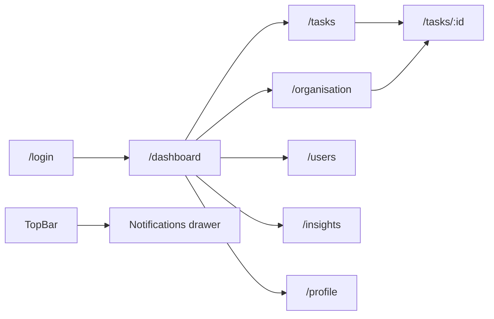
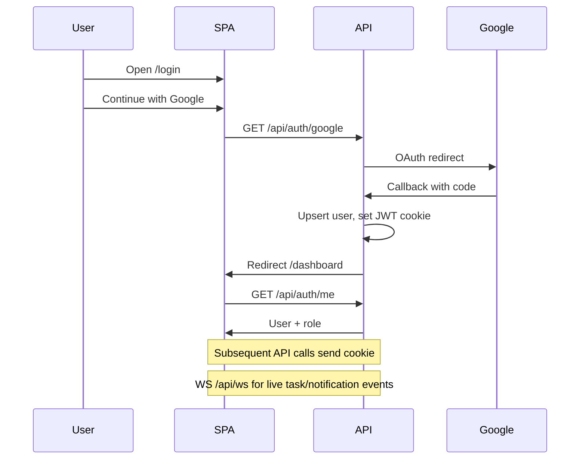

# Webvory-EMS Screens & Navigation

Screen inventory for **Webvory Task Hub**. Implements the UX for [`requirement.md`](./requirement.md). Use this when building pages, empty/error states, and the Organisation module (Table / Kanban / Chart toggle).

**Product:** Internal Task & Management Dashboard  
**Shell:** Authenticated SPA with left sidebar + top bar (notifications, theme, user menu)  
**Visual direction:** Modern internal tool calm surfaces, clear hierarchy, expressive but restrained typography, subtle depth (not purple-gradient AI defaults). Support light and dark themes.

---

## 1. Information architecture

### Primary nav (sidebar)

| Label | Route | Visible to |
|-------|-------|------------|
| Dashboard | `/dashboard` | All roles |
| Organisation | `/organisation` | All roles |
| Tasks | `/tasks` | All roles |
| Team | `/users` | All roles |
| Insights | `/insights` | All roles |
| Profile | `/profile` | All roles |

Admin-only secondary: Audit (optional link under Profile or Team) if exposed in UI; otherwise admin-only API is enough for the assignment.

### Top bar

- Product mark / “Webvory”
- Global search shortcut (optional; may deep-link to `/tasks?search=`)
- Notifications bell (unread badge) → drawer
- Dark mode toggle
- User avatar menu: Profile, Logout

---

## 2. Auth & data flow

---

## 3. App shell (authenticated)

### Layout

- **Left sidebar:** nav links, collapse on tablet, drawer on mobile
- **Main:** page header (title + actions) + content
- **Top bar:** notifications, theme, avatar

### Shared components

Button, Modal, Input, Select, Table, Pagination, StatusBadge, PriorityBadge, TaskCard, LoadingSpinner, EmptyState, ConfirmDialog, Sidebar, TopBar, NotificationDrawer

### Global states

| State | Behavior |
|-------|----------|
| Session loading | Full-shell skeleton until `/api/auth/me` resolves |
| 401 | Clear session → `/login` |
| Offline / API error toast | Sonner-style toast; page-level retry where critical |

---

## 4. Screen catalog

### 4.1 Login `/login`

**Purpose:** Google sign-in only. Brand-first, single CTA.

**Layout:** Full-viewport centered composition (no app sidebar). Brand name hero-level; one short supporting line; one primary button “Continue with Google”. Atmosphere via subtle gradient/pattern background (not flat white only).

**Components:** Brand mark, Button (OAuth), optional error banner.

**Role visibility:** Public. Authenticated users redirect to `/dashboard`.

**States:**

| State | UI |
|-------|-----|
| Default | Brand + Google CTA |
| Loading (redirect) | Button disabled / spinner |
| Error (OAuth failed) | Inline error + retry CTA |
| Empty | N/A |

**Mobile:** Same single-column composition; comfortable tap target for Google button.

**Notes:** No email/password fields. No “sign up with password”.

---

### 4.2 Dashboard `/dashboard`

**Purpose:** Quick overview of team work (take-home §1).

**Layout:** Page title “Dashboard” + optional “New task” button. Grid of stat cards, then “My tasks” list and overdue strip. Optional Insights teaser widget.

**Stat cards (required):**

1. Total Tasks  
2. Pending  
3. In Progress  
4. Completed  
5. Overdue  
6. Assigned to me  

**Components:** StatCard, StatusBadge, PriorityBadge, TaskCard (compact), Button, LoadingSpinner, EmptyState.

**Role visibility:** All roles. “New task” visible to all who can create (all roles per RBAC).

**States:**

| State | UI |
|-------|-----|
| Loading | Skeleton cards + list placeholders |
| Empty (no tasks) | EmptyState + CTA “Create first task” |
| Error | Error panel + Retry |
| Success | Live numbers from `GET /api/dashboard` |

**Mobile:** Stats in 2-column grid; lists stack full width.

**Destructive:** None on this screen.

---

### 4.3 Tasks list `/tasks`

**Purpose:** Filterable, searchable, paginated task table (take-home §3).

**Layout:** Header with “New task”. Toolbar: search input, status/priority/assignee selects, sort select. Table below. Pagination footer.

**Table columns:** Name, Assignee, Priority, Status, Due date, Created, Updated. Row click → `/tasks/:id`. Row actions: Edit (modal or navigate), Delete (confirm).

**Components:** Input, Select, Table, Pagination, StatusBadge, PriorityBadge, Modal (create/edit), ConfirmDialog, Button.

**Role visibility:** Delete action hidden for `member`. Edit restricted per RBAC (own vs any).

**Query sync:** Filters reflected in URL query string (`?status=&priority=&assignee=&search=&page=&limit=&sort=`) so refresh/share works.

**States:**

| State | UI |
|-------|-----|
| Loading | Table skeleton |
| Empty (no matches) | EmptyState “No tasks match filters” + Clear filters |
| Empty (none exist) | EmptyState + Create CTA |
| Error | Inline error + Retry |
| Delete confirm | ConfirmDialog |

**Mobile:** Card list instead of wide table (TaskCard rows) or horizontal scroll table; filters in a bottom sheet / collapsible panel.

---

### 4.4 Task detail `/tasks/:id`

**Purpose:** Full task view, update in place, comments, activity, attachments (take-home §8 + bonuses).

**Layout:**

- Back link to `/tasks` or Organisation
- Title + StatusBadge + PriorityBadge
- Two-column on desktop: main (description, comments, attachments) | side (assignee, due date, meta, activity timeline)
- Edit controls inline or “Edit” opening fields

**Components:** Input, Select, Textarea, Button, StatusBadge, PriorityBadge, CommentList, CommentComposer, AttachmentList, ActivityTimeline, ConfirmDialog, Modal.

**Role visibility:** Fields disabled when user cannot edit. Delete only admin/manager.

**States:**

| State | UI |
|-------|-----|
| Loading | Detail skeleton |
| Not found | 404 empty + Back to tasks |
| Error | Error + Retry |
| Saving | Control-level busy / disabled |
| Comment empty | “No comments yet” |
| Activity empty | “No activity yet” |
| Delete confirm | ConfirmDialog |

**Mobile:** Single column; side meta collapses above or below description.

**Live updates:** On `task.updated` / new comment via WebSocket, refresh relevant sections or patch local state.

---

### 4.5 Organisation `/organisation`

**Purpose:** Team organisation hub with three presentations of the same domain: people hierarchy + tasks. **View toggle:** Table | Kanban | Chart (requirement §5).

**Shared layout:**

- Page title “Organisation” + subtitle (“Team structure, board, and hierarchy”).
- **ViewToggle** segmented control: `table` | `kanban` | `chart` (persist in `localStorage` key `organisation.view`).
- Shared actions: New task (opens create modal); Admin/Manager: “Assign manager” shortcut when a person is selected.
- Optional shared search input (filters Table rows, Kanban cards by title, Chart node highlight).

**Role visibility:** All roles can switch views. Chart manager reassignment and Table manager edits: admin/manager only.

---

#### 4.5.A Table view

**Purpose:** Roster of people in the org with manager and workload signals.

**Columns:** Avatar/Name, Email, Role, Job title, Reporting manager, Direct reports (count), Open tasks (count).

**Behavior:**

- Sort by name / role / open tasks.
- Row click → NodeDetail-style sheet (manager, reportees, open tasks) or navigate to filtered `/tasks?assignee=`.
- Admin/manager: inline or sheet control to set reporting manager (same API as Chart).

**Components:** Table, Pagination (if large), RoleBadge, Avatar, PersonSheet, ViewToggle, LoadingSpinner, EmptyState.

**States:** Loading skeleton · Empty “No teammates yet” · Error + Retry · Save manager error toast.

**Mobile:** Person cards instead of wide table.

---

#### 4.5.B Kanban view

**Purpose:** Drag-and-drop task board by status (PlayStack Kanban pattern → task statuses).

**Columns (fixed order):**

| Column ID | Title |
|-----------|-------|
| `pending` | Pending |
| `in_progress` | In Progress |
| `completed` | Completed |
| `blocked` | Blocked |

**Wire-level DnD notes:**

- `@dnd-kit` `DndContext` + `DragOverlay`
- Column `id` === `task_status`; card `id` === task id
- On `DragEnd`: optimistic move → `PUT /api/tasks/{id}` `{ status }` → toast; rollback on failure
- Card click → `/tasks/:id`
- Drag disabled when RBAC forbids edit

**Components:** KanbanBoard, KanbanColumn, KanbanCard, DragOverlay, ViewToggle, EmptyState.

**States:** Board skeleton · Empty board CTA · Empty column placeholder · Drag overlay · API fail rollback · WS live move.

**Mobile:** Horizontal scroll columns.

---

#### 4.5.C Chart view

**Purpose:** Interactive reporting hierarchy (PlayStack OrgChart + React Flow + dagre), adapted to OAuth users + optional task nodes.

**Layout:** Full-bleed canvas under the toggle; minimap/controls; optional right **NodeDetailPanel**.

**Behavior:**

- Auto-layout TB via dagre from `GET /api/organization/tree`.
- Person nodes: name, avatar, role, job title.
- Optional task nodes with dashed edges to assignees; unassigned task pool (PlayStack-style).
- Admin/manager: drag person onto another to set manager; edge click to clear; cycle rejected with toast.
- Node click → detail panel (reportees via `GET /api/users/{id}/reportees`, open tasks, edit manager).
- Members: read-only pan/zoom; no manager mutations.

**Components:** OrgChart, OrgTreeNode, TaskNode (optional), NodeDetailPanel, ReporteesList, ViewToggle, ConfirmDialog (break reporting link).

**States:** Canvas skeleton · Empty tree (single user root) · Cycle/forbidden toast · Panel loading · WS refresh tree on manager or task assign changes.

**Mobile:** Pan/zoom canvas; prefer tap → panel over drag-reassign (offer “Set manager” select in panel on touch).

---

**Destructive:** Confirm before clearing a reporting edge; task delete only from detail/list, not Chart.

---

### 4.6 Team / Users `/users`

**Purpose:** List OAuth-provisioned team members; admin changes roles.

**Layout:** Table or people grid: avatar, name, email, role, joined. Admin: role Select per row.

**Components:** Table, Select, Status-like RoleBadge, EmptyState, LoadingSpinner.

**Role visibility:** Role editor only for `admin`. Members/managers view-only.

**States:**

| State | UI |
|-------|-----|
| Loading | Skeleton rows |
| Empty | “No teammates yet share the app login link” |
| Error | Retry |
| Role save error | Toast + revert select |

**Mobile:** Stacked person cards.

**Note:** No “create user with password”. Users appear after Google login. `POST /api/users` only if needed for seed/demo not a primary UI form.

---

### 4.7 Insights `/insights`

**Purpose:** Display external API (JSONPlaceholder) data (take-home §7).

**Layout:** Page title “Insights”. Intro line explaining proxy. List/table of posts (title, body snippet, external id). Refresh button.

**Components:** Table or card list, Button, LoadingSpinner, EmptyState, ErrorState.

**Role visibility:** All roles.

**States:**

| State | UI |
|-------|-----|
| Loading | Skeleton |
| Upstream error | Friendly error from backend 502 + Retry |
| Empty | “No external items” |
| Success | Mapped posts from `GET /api/external/posts` |

**Mobile:** Card stack.

**Optional:** Compact widget on Dashboard linking here.

---

### 4.8 Notifications drawer (from top bar)

**Purpose:** In-app notifications (bonus).

**Layout:** Right-side drawer: list of notification rows (title, body, time, unread dot). Actions: Mark all read. Click row → navigate to related `/tasks/:id` if present, mark read.

**Components:** NotificationDrawer, NotificationItem, Button.

**Role visibility:** All authenticated users (own notifications only).

**States:**

| State | UI |
|-------|-----|
| Loading | Skeleton list |
| Empty | “You’re all caught up” |
| Error | Retry |
| Live | New items prepend on WS `notification.created` |

**Mobile:** Full-screen sheet instead of side drawer.

---

### 4.9 Profile / Settings `/profile`

**Purpose:** Show Google profile; theme preference; logout.

**Layout:** Avatar (from Google), name, email, role (read-only). Dark mode toggle. Logout button.

**Components:** Avatar, Button, theme Switch/Toggle.

**Role visibility:** Own profile only.

**States:**

| State | UI |
|-------|-----|
| Loading | Skeleton |
| Error | Retry session |
| Success | Populated from `/api/auth/me` |

**Mobile:** Same single column.

**Destructive:** Logout is soft (confirm optional).

---

### 4.10 Create / Edit task modal or `/tasks/new`

**Purpose:** Shared form for create and edit (from Dashboard, Tasks, Organisation).

**Fields:** Title (required), Description, Status, Priority, Assignee (Select from `GET /api/users`), Due date.

**Components:** Modal, Input, Textarea, Select, Button.

**Validation:** Inline errors; mirror backend schema messages.

**States:** Submitting disabled button; API validation errors mapped to fields; success closes modal + invalidates lists/board.

**Prefer:** Modal from list/dashboard; full page optional. Organisation may open the same modal via “Add task” or rely on Tasks page.

---

## 5. Cross-cutting UX rules

1. **Confirm before delete** tasks and attachments use ConfirmDialog.
2. **Toasts** success/failure for mutations (status move, save, upload).
3. **Badges** StatusBadge and PriorityBadge color tokens consistent across list, detail, Kanban.
4. **Empty vs error** never show a blank white main; always EmptyState or ErrorState.
5. **Keyboard** Esc closes modal/drawer; focus trap in Modal.
6. **Dark mode** all screens support both themes; test Organisation Kanban columns and Chart node contrast.
7. **Live data** Organisation (all three views) and Tasks list subscribe to WS invalidation; avoid full-page flicker.

---

## 6. Route summary

| Route | Screen | Auth |
|-------|--------|------|
| `/login` | Login (Google only) | Public |
| `/` | Redirect → `/dashboard` or `/login` | |
| `/dashboard` | Dashboard | Required |
| `/organisation` | Organisation (Table / Kanban / Chart toggle) | Required |
| `/tasks` | Task list | Required |
| `/tasks/:id` | Task detail | Required |
| `/users` | Team | Required |
| `/insights` | External API data | Required |
| `/profile` | Profile & theme | Required |

---

## 7. Design tokens (guidance)

Define CSS variables for:

- `--bg`, `--surface`, `--border`, `--text`, `--text-muted`
- `--accent` (single brand accent avoid default purple-on-white cliché)
- Status: pending, in_progress, completed, blocked
- Priority: low, medium, high, urgent

Typography: purposeful sans for UI (not system-default Inter-only look if avoidable pick one distinctive but readable family via Google Fonts). Spacing scale consistent with Tailwind.

Motion (2–3 intentional uses): sidebar collapse, drawer slide, Kanban drag overlay / Chart layout settle no decorative noise.

---

## 8. Implementation mapping (PlayStack → Webvory)

| PlayStack | Webvory |
|-----------|---------|
| `KanbanBoard.tsx` | Organisation **Kanban** view |
| `KanbanColumn.tsx` | Status columns |
| `KanbanCard.tsx` | TaskCard on board |
| Employee Active/Inactive columns | **Do not use** four task statuses |
| `OrgChart.tsx` + dagre + React Flow | Organisation **Chart** view |
| `OrgTreeNode.tsx` / `TaskNode.tsx` / `NodeDetailPanel.tsx` | Person/task nodes + detail panel |
| Employees table patterns | Organisation **Table** view (users + manager + workload) |
| View mode | **New:** `ViewToggle` Table \| Kanban \| Chart |

---

## 9. Acceptance checklist (screens)

- [ ] Login has only Google CTA; no password UI
- [ ] Dashboard shows all six required aggregates
- [ ] Tasks list: search, filters, sort, pagination (server-driven)
- [ ] Task detail: edit, comments, activity, attachments
- [ ] Organisation: ViewToggle Table / Kanban / Chart
- [ ] Organisation Table: members, manager, open tasks
- [ ] Organisation Kanban: four columns, DnD updates status via API
- [ ] Organisation Chart: tree layout, cycle-safe manager assign, detail panel
- [ ] Team page lists OAuth users; admin can change roles
- [ ] Insights shows proxied external posts with error/retry
- [ ] Notifications drawer works with unread + mark read
- [ ] Profile shows Google identity + dark mode + logout
- [ ] Loading / empty / error / confirm patterns present on primary screens
- [ ] Responsive behavior documented above is implemented
